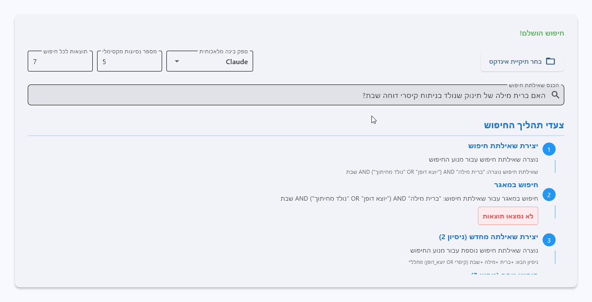

# Ituria - A Powerful Tora assistant


watch the live demo [here](https://huggingface.co/spaces/sivan22/Ituria)

## Overview
this project using the power of LLMs with the approach of Agents to provide an accurate and effective answer to users' queries.

## Features
- a Chat interface for interacting with the agent
- the agent has the ability to search the jewish library, read a specific text or get commentaries for a specific verse
- Flexible LLM provider support (Claude, GPT, Ollama)

## Prerequisites
- Python 3.11 or higher
- At least one of the following API keys (stored in `.env`):
  - Anthropic API key (for Claude)
  - OpenAI API key (for GPT)
  - Google API key (for Gemini)
Or a Local Ollama setup (for open-source models).

## Installation
1. Clone the repository
2. Install dependencies:
```bash
pip install -r requirements.txt
```

3. Set up a `.env` file with your credentials:
```
ANTHROPIC_API_KEY=your_anthropic_api_key
OPENAI_API_KEY=your_openai_api_key
GOOGLE_API_KEY=your_google_api_key
```
configure the index path:
```
INDEX_PATH=path/to/your/index
```


## Usage
### Quick Start
Run the Streamlit UI to see the system in action:

```bash
streamlit run app.py
```


## How It Works
The system uses a reason and act (ReAct) architecture, to achive an aoutonomous agent.

The agent can use the search engine to find relevant passages in the Jewish Library, and use those passages to answer user queries.

## Dependencies
Key dependencies include:
- `langchain` and related packages for LLM integration
- `streamlit` for the user interface
- `tantivy` for document indexing and search
- `python-dotenv` for environment management
- Various LLM provider packages (anthropic, openai, ollama)

## Configuration
- Modify `tantivy_search.py` to customize search settings
- Modify `sefaria.py` to configure Sefaria API access
- Adjust `agent.py` to configure agent behavior
- Update `llm_providers.py` to add or modify LLM providers
- Customize `app.py` for UI modifications

## Security
- Store API keys and sensitive data in environment variables
- Never upload your `.env` file to version control
- Ensure proper access controls for the Tantivy index

## Troubleshooting
- Verify the Tantivy index exists and is accessible
- Check API key permissions for your chosen LLM provider
- Ensure proper file permissions for the document library
- Review logs for detailed error information

## Contributing
Contributions are welcome! Please feel free to submit pull requests or open issues for bugs and feature requests.

## License
MIT
