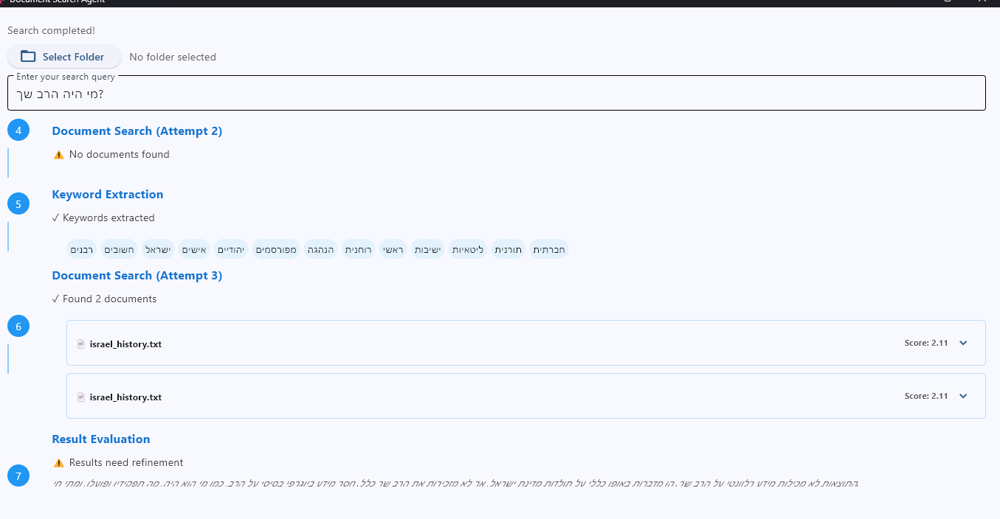

# AI Document Search Agent



## Overview
This project implements an intelligent document search and question-answering system that combines:
- Tantivy for efficient document indexing and retrieval
- Anthropic's Claude-3 for keyword extraction, result evaluation, and answer generation
- Custom search refinement workflow for improved answer accuracy

## Features
- Smart document indexing with Tantivy for improved search relevance
- Intelligent keyword extraction from natural language questions
- Automated search result evaluation and refinement
- Multi-attempt search strategy with confidence scoring
- Context-aware answer generation using Claude-3
- Comprehensive error handling and logging
- Support for multilingual queries and documents
- Configurable search parameters (max iterations, results per search)

## Prerequisites
- Python 3.11+
- Tantivy index from the otzaria app
- Anthropic API Key (Claude-3 access required)

## Installation
1. Clone the repository
2. Install dependencies:
```bash
pip install -r requirements.txt
```

3. Set up `.env` file with your credentials:
```
ANTHROPIC_API_KEY=your_anthropic_api_key
```

## Usage
### Quick Start
Run the Flet UI to see the system in action:

```bash
python flet_ui.py
```

The UI allows you to:
- Select a Tantivy index folder
- Configure max iterations per search
- Set number of results per search
- View detailed search process steps
- See highlighted search results

## How It Works

### Document Indexing
- Documents are pre-indexed using Tantivy through the otzaria app
- Tantivy provides efficient and accurate document indexing

### Search and Answer Generation
1. **Keyword Extraction**: Uses Claude-3 to extract relevant search keywords from the question
2. **Document Search**: Performs Tantivy search with extracted keywords
3. **Result Evaluation**: 
   - Evaluates search results using Claude-3
   - Assigns confidence scores to determine result quality
   - Automatically refines search if confidence is low
4. **Answer Generation**: 
   - Generates comprehensive answers using relevant document contexts
   - Structures responses clearly and acknowledges any information gaps

## Configuration
- Modify `tantivy_search_agent.py` to customize Tantivy settings and analysis
- Adjust `agent_workflow.py` to configure:
  - Confidence thresholds
  - Claude-3 parameters
  - Answer generation requirements
- Customize `flet_ui` to fit the UX/UI to your needs

## Security
- Store API keys and sensitive data in environment variables
- Never commit `.env` file to version control
- Ensure proper access controls on Tantivy index

## Troubleshooting
- Verify Tantivy index exists and accessible
- Check Anthropic API key permissions and Claude-3 access
- Ensure proper file permissions for document directory
- Review logs for detailed error information

## Contributing
Contributions are welcome! Please submit pull requests or open issues for bugs and feature requests.

## License
MIT
